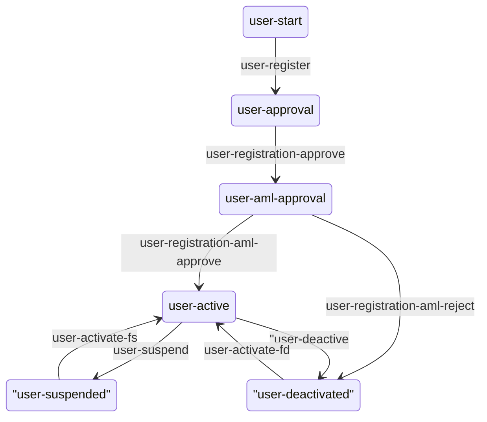

# workflow
State Machine and flow chart orchestration workflow service based on Zeebe

```mermaid

stateDiagram-v2
    start: user-start
    active: user-active
    amlap: user-aml-approval
    ap: user-approval
    de: "user-deactivated"
    sus: "user-suspended"


    start --> ap : user-register
    ap --> amlap : user-registration-approve
    amlap --> active : user-registration-aml-approve
    amlap --> de : user-registration-aml-reject
    active --> sus : user-suspend
    active --> de : "user-deactive
    de --> active : user-activate-fd
    sus --> active : user-activate-fs

```

       

